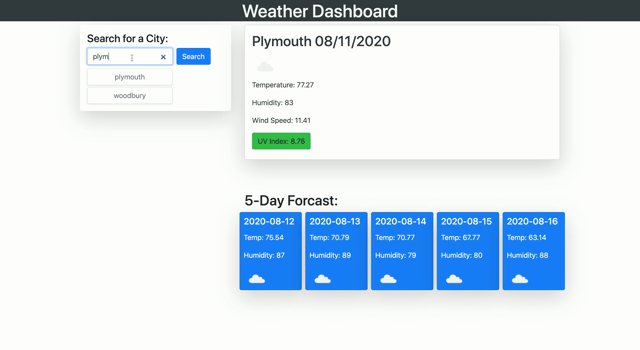

# Weatherapp dashboard

## Description

This is a simple java script application that provides the ability to search for a city in united states and view its most current weather. It also displays the user the 5 day forecast for the searched city.

## Link to the application
https://afazeez82.github.io/weatherapp.githubio.com/

## GLimpse of the app

## Give Credit
I want to give credit to StackFlow and youtube. Found some of the solution from there.